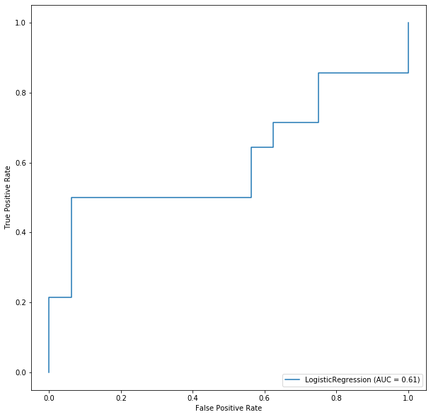

## Wybrane Dane {.smaller}
 - 3 Ramki danych (admissions, patients ,labevents),
 - wybrane tylko rekordy dotyczące ostatniego pobytu w szpitalu.
 
```{r echo=FALSE, cache=TRUE ,fig.align='center'}

processFile = function(filepath) {
  con = file(filepath, "r")
  while ( TRUE ) {
    line = readLines(con, n = 1)
    if ( length(line) == 0 ) {
      break
    }
    print(line)
  }

  close(con)
}


processFile("df_info.txt")

```


## Przygotowanie danych 

Będziemy przewidywać zmienną hospital_expire_flag (mówi nam, czy pacjent zmarł w szpitalu).


 - Usunięcie kolumny discharge_location (przedstawia te same dane),
 - usunięcie lub agregacja kolumn z datami,
 - kodowanie label lub one-hot encoding.
 
 
 
## Regresja Logistyczna

 - One-hot Encoding z usunięciem mniej licznych kategorii,
 - agregacja daty do wieku pacjenta.
 
Wynik modelu na zbiorze testowym: 


```{r echo=FALSE,out.width="42%",fig.align='center',}


```


## Drzewo decyzyjne  {.smaller}

 - Label encoding,
 - usunięcie kolumn zawierających daty.
 
Struktura i wynik modelu: 


```{r, echo=FALSE,out.width="45%", out.height="20%",fig.cap="caption",fig.show='hold',fig.align='center'}


knitr::include_graphics(c("tree.png","tree_score.png"))
``` 
